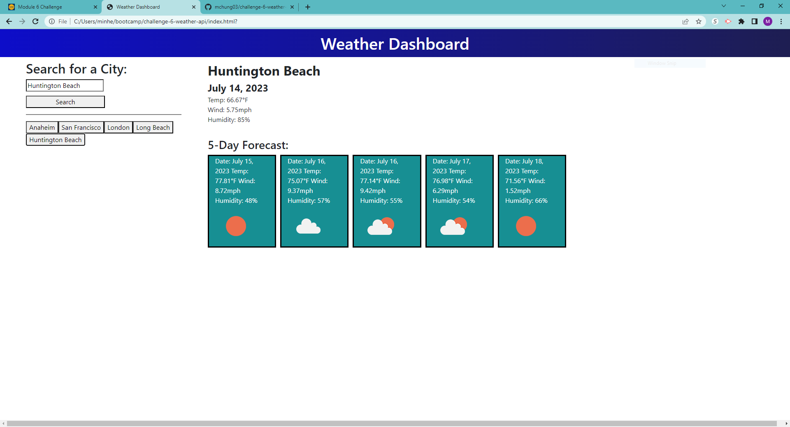
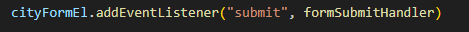
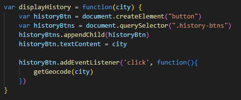
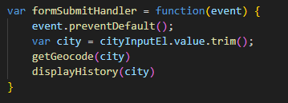
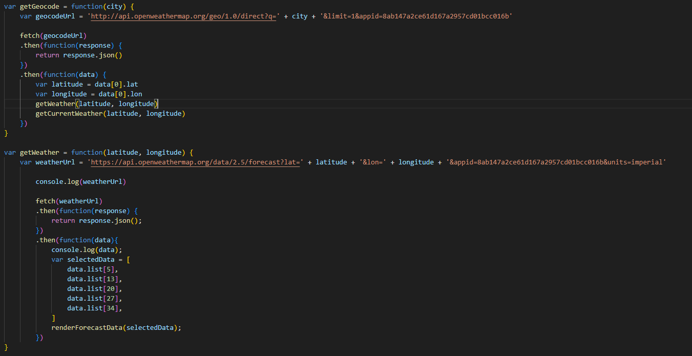
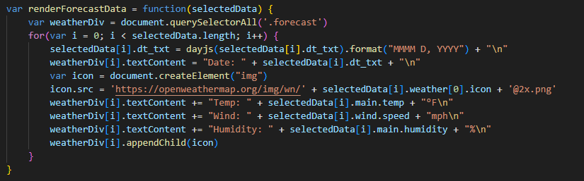
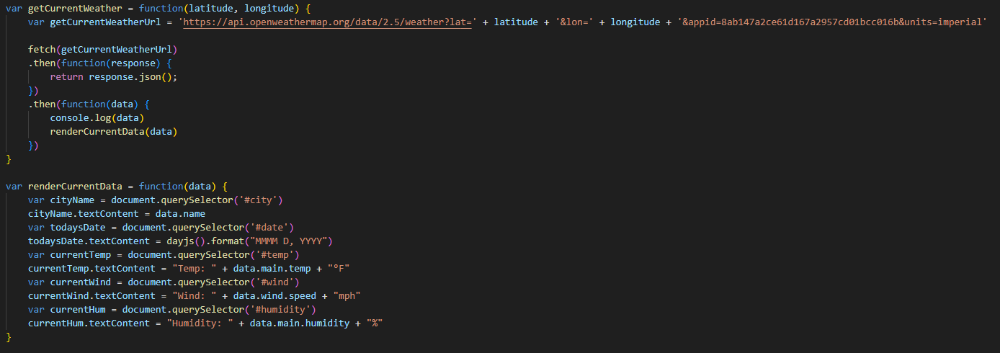

# challenge-6-weather-api

## Description

This website uses the OpenWeather Map API to retrieve data and display the current weather and five day forecast after the user inputs a city. Its purpose is for users to check the weather in a particular city. I learned to incorporate third party APIs, as well as linking different APIs to work together. Check it out: 

## Installation

N/A

## Usage

 
Multiple buttons are created when you search up different cities. Whenever you click on a button, it displays the current and future weather of the city.

 
This code starts everything with a click of the search button and triggers the function formSubmitHandler.

 
Once a city is entered and the button is created, it retrieves data for that city whenever the button is clicked.

 
This code snippet takes the input, which is the city, of the user and plugs the value into the getGeocode and displayHistory functions.

 
The first geocode API is used to get the latitude and longitude values, which is translated from the user's input of a city, for the weather API. The values are then put into the weather API to return weather data of that city and then runs the renderForecastData function.

 
The data received from the API is inputted into a for loop to generate values to put into a card element, as well as append an icon that changes based on the weather conditions. This data retrieves values for the next 5 days.

 
The same is done to retrieve data for the current weather.

## APIs Used
* [Current weather data](https://openweathermap.org/current)
* [5 day weather data](https://openweathermap.org/forecast5)
* [Geocoding data](https://openweathermap.org/api/geocoding-api)
* [Weather condition icons](https://openweathermap.org/weather-conditions)

## Technology Used

This project was built using HTML, CSS, and JavaScript and uses the following technologies: 
* [Bootstrap](https://getbootstrap.com/): CSS framework
* [DayJS](https://day.js.org/): To get the current and future dates

## Credits

* mdn: https://developer.mozilla.org/en-US/docs/Web/HTML/Element/input/search
* stackoverflow: https://stackoverflow.com/questions/9980416/how-can-i-insert-new-line-carriage-returns-into-an-element-textcontent
* Classmate Joon Moon
* Tutor Joem Casusi